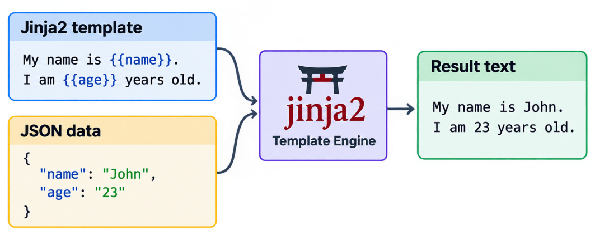


# Introduction

Jinja2 is one of the most-used template engines for Python. 

The idea of templating is simple: use placeholders in your document that the template engine will replace with the real values. The following picture illustrates the main idea behind the Jinja template engine. 


# Table of Content
{:.no_toc}

* TOC
{:toc}

# Jinja basics

In this section, we'll address the following:

*   Jinja delimiters (tags)
*   Data types
*   `none`, `null`, `defined, `undefined`
*   Jinja operators overview (`is`, `in`, `|` etc)
*   Whitespace control

## Jinja delimiters (tags)

Jinja tags are used to identify Jinja code. All text outside the tags is given as output without change.

| Jinja tag | Example | Description |
| --- | --- | --- |
| `` | `` | Statement. Sets the variable _i_ to the integer value 123 |
| `{{ ... }}` | `{{ i }}` | Print. Outputs the value of `i` |
| `{# ... #}` | {# Testing Jinja #} | Comment. Does nothing, outputs nothing. |

## Variables

Similar to Python, Jinja variables are case-sensitive, so `my_var` and `my_var` are two different variables.  
A variable name can contain alphanumeric characters, underscores `_`, and dashes `-`, but not special characters like `[`, `]`, `{`, `}`, `\`, `"`, or `'`.

To access the attribute of a variable (dict), you can use dot `my_dict.my_attr` or "subscript" syntax `my_dict["my_attr"]`.

The following lines do the same thing:
```
{{ foo.bar }}  
{{ foo['bar'] }} {# Useful if 'bar' is a reserved word and can't be accessed via dot (.) #}
```

If a variable or attribute does not exist, you will get back an undefined value. The default behavior is to evaluate to an empty string if printed or iterated over, and to fail for every other operation.

## Data types

| Data type | Example | Description |
| --- | --- | --- |
| Integer | `0,1,3_134` | Whole numbers without a decimal part.  <br>The `_` character can be used to separate groups for legibility. |
| Float | `42.23,42.1e2,`<br>`123_456.789` | Real numbers with a decimal separator. |
| String | `"apple"`, <br><br>`'Banana'`,  <br>`""`, <br><br>`"\n"` | A Unicode string enclosed in double `"` or single `'` quotes.<br><br>Each individual character can be accessed by index, similar to a list: `{{ "Hello"[0] }}` returns one character `"H"`. The backslash `\` ("escape character") is used to represent control characters like new line `"\n"` and tab `"\t"`, use double backslash `"\\"` for a backslash, `\"` for double quotes, and `\'` for a single quote inside the string. For example, `"Hello\n\"World\"` produces the following result:<br>`Hello`<br>`"World"` |
| Boolean | `true` or `false` | Used in logical expressions.<br><br>For example, `1 == 1` evaluates to `true`, while `1 == 2` to `false`. Empty values are considered `false` when used in logical expressions, such as `0`, `""`, `none`, `[]`, and `{}` |
| List | `[1, 2, "three"]` | A list is an array.<br><br>Its elements can be any data type. They are accessed by index, and the first element has an index of 0. For example, `my_list[1]` returns the second element. |
| Tuple | `(1, 2, "three")` | A tuple is like a list that cannot be modified ("immutable").<br><br>If a tuple has only one item, it must be followed by a comma `("1-tuple",)`. Tuples are usually used to represent items of two or more elements. As with lists, tuples are also indexed beginning from 0.  <br>For example, `my_tuple[1]` returns the second element. |
| Dictionary (dict) | `my_dict = { "key1":1, "key2":"Value2" }` | Data in a dict is stored as key-value pairs.<br><br>Keys can be Strings, Numbers, Boolean, None, etc. Keys must be unique. Values can be any data type. To indicate an empty value, a special word `null` is used. Values are accessed by dot `.` or brackets `[]`. For example, `my_dict.key1` returns 1, and `my_dict["key2"]` returns `"Value2"` |

> The special constants `true`, `false`, and `none` are **lowercase**. They can also be written in title case (`True`, `False`, and `None`). However, since all Jinja identifiers are lowercase, you should use the lowercase versions for consistency.

To determine the variable type, you can use a number of built-in `is` tests. While obvious for types like integers and booleans, it becomes trickier for strings and lists because the string is basically a list of characters that can be accessed by index.

The following table shows how to identify each Jinja data type. For example, `{{ my_string is string }}` will render to `True`.

| JSON definition | Jinja set definition | `is` tests that return `true` |
| --- | --- | --- |
| `"my_string": "John"` | `` | iterable, sequence, string |
| `"myInt": 5`         | `` | number, integer |
| `"myFloat": 1.2`     | `` | number, float |
| `"myBool": true`     | `` | boolean |
| `"myNothing": null`  | `` | none |
| `"myDict": {"key1":5}`   |`` | iterable, sequence, mapping |
| `"my_list": [1,2,"three"]`|` ` | iterable, sequence |

## `null`, `none`, `undefined`, `defined`

It may be hard at first to understand the difference between these four keywords because they all mean the absence of value. Not to worry - we'll explain each in greater depth here!

| Name | Description |
| --- | --- |
| `null` | Used in JSON to represent an empty value. It should never appear in Jinja code as it will produce a syntax error. Null's equivalent in Jinja is `none`. |
| `none` | Jinja constant that represents an empty value. |
| `undefined` and `defined` | Names of Jinja's tests to check if the variable is defined. Note that `undefined` is the same as `not is defined`. Also, it is important to understand that a variable can have a value of `none` or an empty string `""` and still be defined. |

The table here demonstrates the difference between these keywords:

| Value    | `is defined` | `is none` | Description |
| ---      | --- | --- | --- |
| `""`     | True | False | Empty string |
| `none`   | True | True | Empty value |
| `badVar` | False | False | A variable that does not exist (not defined) |

## Jinja operators overview

| Operator | Example | Description |
| --- | --- | --- |
| `in`  | `{{ 1 in [1, 2, 3] }} True` <br> `{{ "el" in "Hello" }} True`  <br>`{{ 1 not in [1, 2, 3] }} False`  <br>`{{ not 1 in [1, 2, 3] }} False` | Returns `true` if the left operand is contained in the right. Supports negation using an infix notation - `not in`. |
| `is`  | `{{ "a" is string }} True`  <br>`{{ "a" is not string }} False`  <br>`{{ not "a" is string }} False` | Returns true if the test is successful. See the list of built-in tests in the test chapter. Supports infix negation - "is not". |
| `\|`  | `{{ userName\|default("sir") }}` | Applies a filter. |
| `~`   | `{{ "Hello " ~ userName }}`  <br>Hello John | Converts all operands into strings and concatenates them. |
| `()`  | `{{ my_var.replace(" ", "_") }}` | Calls a callable. |
| `.` and `[]` | `{{ myDict["myAttr"] }}` | Gets an attribute of an object. |

## Whitespace control

A minus sign "-" in the opening Jinja tag removes spaces and newlines before the tag. A minus sign "-" in the closing tag removes spaces and newlines after the tag.

The following example demonstrates how the whitespace control works. The dot "·" here represents the space character. 

| Jinja code | Output |
| --- | --- |
| `·····Text····` | `Text` |
| `·····Text····` | `··Text` |
| `·····Text····` | `·····Text` |
| `·····Text····` | `·····Text····` |

# Expressions

Here, we'll share information on:

*   Mathematical expressions
*   Comparison expressions (`<`, `==`, `>`)
*   Logic (boolean) expressions (`and`, `or`, `not`)
*   Logical expressions with non-boolean values

## Mathematical expressions

Note that `+` and `*` operators can be used with strings.

| Operator | &nbsp;&nbsp;&nbsp;&nbsp;&nbsp;&nbsp;Example&nbsp;&nbsp;&nbsp;&nbsp;&nbsp;&nbsp; | Result | Description |
|---|---|---|---|
| +   | `{{ 1 + 1 }}`  <br>`{{ "a"+"b" }}` | `2`  <br>`"ab"` | Adds two objects together. Usually, the objects are numbers, but if both are strings or lists, you can concatenate them this way. However, this is not the preferred way to concatenate strings. For string concatenation, take a look at the `~` operator. |
| `-`  | `{{ 3 - 2 }}` | `1`   | Subtracts the second number from the first one. |
| `/`  | `{{ 3 / 2 }}` | `1.5` | Divides two numbers. The returned value will be a floating point number. |
| `//`  | `{{ 3 // 2 }}` | `1`   | Divides two numbers and returns the truncated integer result. |
| `%`   | `{{ 11 % 7 }}` | `4 `  | Calculates the remainder of an integer division. |
| `*`  | `{{ 2 * 2 }}` <br> `{{ "a" * 3 }}` | `4` <br> `"aaa"` | Multiplies two numbers. This can also be used to repeat a string multiple times. |
| `**` | `{{ 2 ** 3 }}` | `8`   | Raises the left operand to the power of the right operand. |

## Comparison expressions

Jinja inherits the comparison operators from Python. 

* `==` - true if both operands are **equal**
* `!=` - true if both operands are **not equal**
* `>` - true if the left operand is **greater than** the right operand
* `>=` - true if the left operand is **greater than or equal** **to** the right operand
* `<` - true if the left operand is **lower than** the right operand
* `<=` - true if the left operand is **lower than or equal** **to** the right operand

Comparisons can be chained arbitrarily. For example, `x < y < z` is equivalent to `x < y and y < z`, except that `y` is evaluated only once. Note that in both cases, `z` is not evaluated at all when `x < y` is found to be `false`. More information can be found in the [Python documentation for comparison operations](https://docs.python.org/2/reference/expressions.html#comparisons).

## Logic (boolean) expressions

Logic operators are inherited from Python, the same as comparisons. In Python, the left operand is always evaluated before the right operand.   
Python uses short-circuiting when evaluating expressions involving the `and` or `or` operators. When using those operators, Python does not evaluate the second operand unless it is necessary to resolve the result. That allows statements such as `if (s != None) and (len(s) < 10)` to work reliably.

*   `or` - true if one of the operands is true. If the left operand is true, then stops and returns true. If the left operand is false, then the right operand is checked.
*   `and` - true if both operands are true. If the left operand is false, then stops and returns false. If the left operand is true, then the right operand is checked.
*   `not` - negates a statement. Returns true if the right operand is false.

## Logical expressions with non-boolean values

The same as Python, Jinja allows non-boolean values in logical expressions. For example, to output the value of variable `my_var` or a default value if it is empty, you can use:
```
{{ my_var or "default value" }}
```

In this example, the _or_ operator returns `my_var` if it has a truthy value, or returns a `"default value"` if not. This is useful for variable output or assignments that need fallback values.

Non-boolean values are considered true (also known as truthy), or false (also known as falsy) based on their value. Basically, all empty values are considered false, and all other values are considered true.

Here is the list of the most important values that are falsy in a boolean context:

*   `undefined`
*   `none`
*   `0` - integer and float zero
*   `"` - an empty string
*   `[]` - an empty list
*   `{}` - an empty dict
*   `()` - an empty tuple

More information can be found in the [Python documentation for truth value testing](https://docs.python.org/3/library/stdtypes.html#truth-value-testing).

To better understand how it works, we can rewrite the logical expression with conditional expressions.

| Logical expression | Conditional expressions | Description |
| --- | --- | --- |
| `{{ a or b }}` | `{{ a if a else b }}` | Returns `a` if `a` is truthy, otherwise returns `b`. Useful for providing fallback values. |
| `{{ a and b }}` | `{{ b if a else a }}` | Returns `b` if `a` is truthy, otherwise returns `a`. Used when you want a guard rather than a fallback. |
| `{{ not a }}` |     | Always returns a boolean value regardless of its operand. |

The following example shows one of the practical uses of the `and` operator. To remove an element from the list, we need to make sure that list is not empty:
```
my_list and my_list.pop()
```

# Execution flow control

Below, we'll explore:

*   `if` statement
*   Inline `if` expression
*   `for loop` (conditional. over dictionary, sorted, items())
*   Accessing variables across scopes (inside loop)
    

## `if` statement

The `if` statement in Jinja is comparable to the Python `if` statement.

```
   
Good Morning!   
   
Good Afternoon!   
  
Good night!  

```

## Inline `if` expression

This is how to write the if condition in one line. For the print Jinja tag, the syntax looks as follows:
```
{{ my_var if my_var else "default value" }}
```

In this example, the value of `my_var` is printed if it is not empty. Otherwise, `"default value"` is returned. The else part is optional, but it is recommended to specify a default value to handle exceptions. If not provided, the else block implicitly evaluates to an `undefined` object.

Below, we show how to set `my_var` to 0 when it is <0 and leave it untouched otherwise.
```
{# WRONG! my_var is set to undefind when >= 0 #}  
{# RIGHT! my_var is untouched when >= 0 #}
```

## `for` loops

In this section, we'll address:

*   `else` clause in for loop
*   Looping with a condition and special variable `loop`
*   Looping over the dictionary

**`else` clause in for loop**

Jinja has a special clause `else` that can be used in loops. The code in this block is executed when no iteration took place in the for loop. That can happen because the sequence was empty or the filtering removed all the items from the sequence.

```
   
  {{ item }}   
   
  The list is empty   

```

**Looping with the condition and special variable loop**

You can filter the sequence during iteration by using an inline if expression. Inside a for-loop block, you can access a special loop variable like `loop.index` for the number of the current iteration, `loop.first` for detecting the first iteration, and so on.

A complete list of special loop variables is available in the [Jinja for-loop documentation](https://jinja.palletsprojects.com/en/2.11.x/templates/#for-loop). 

The following example will show all elements of the list that are greater than 1 and will detect iteration over the list's first and last elements:
```
   
{{ item }} is  
 First item   
 Last item   
 Middle item   
   

```

This is the result:
```
2 is First item   
3 is Middle item   
4 is Middle item   
5 is Last item 
```

**Looping over the dictionary** 

In all the following three examples, we will use this `food_dict` dictionary.
```
"food_dict": {  
"carrot":{"cost": 1, "category": "vegetable"},  
"banana": {"cost": 3, "category": "fruit"},  
"apple": {"cost": 2.5, "category": "fruit"},  
"tomato": {"cost": 2, "category": "vegetable"}  
}
```

**Getting keys only**

While looping through dict, the item will have the only _key_ of the key-value pair.
```
  
{{ item }}  

```

In the result, only keys are printed:
```
carrot  
banana  
apple  
tomato
```

**Getting keys and values by using items() method**

To get both `keys` and `values,` we need to use the `items()` method.
```
  
The {{ key }}'s cost is {{ val.cost }} and it is a {{ val.category }}  

```

Result:
```
The carrot's cost is 1 and it is a vegetable  
The banana's cost is 3 and it is a fruit  
The apple's cost is 2.5 and it is a fruit  
The tomato's cost is 2 and it is a vegetable
```

**Iterating through the sorted dictionary**

Usually, you need to have the output sorted, which you can do with `dictsort` filter. By default, it sorts by `key`, but you can change it to `values`. You can also change the direction of the sort and adjust case sensitivity. The values should be either numbers or strings, not dictionaries.

You can read more in the [Jinja documentation on dictsort](https://jinja.palletsprojects.com/en/2.11.x/templates/#dictsort).

By default, the dictsort filter sorts by `key`, case-insensitively, and ascending.
```
  
The {{ key }}'s value is {{ val }}  

```

In the result, the output is sorted by `key`:
```
The apple's value is {'cost': 2.5, 'category': 'fruit'}  
The banana's value is {'cost': 3, 'category': 'fruit'}  
The carrot's value is {'cost': 1, 'category': 'vegetable'}  
The tomato's value is {'cost': 2, 'category': 'vegetable'}
```

You can also combine sorting and filtering. In the following example, we output only vegetables, descending by `key`.
```
  
The {{ key }}'s cost is {{ val.cost }}  

```

In this result, the output is sorted by _key_ and filtered by _vegetable_.
```
The tomato's cost is 2    
The carrot's cost is 1  
```

## Accessing variables across scopes (inside loop)

Jinja has very strict variable scoping. If you have an assignment in a loop, it won't work because you don't have access to outer variables inside the loop scope. The solution is to use a special `loop` variable or use a namespace object to allow changes across scopes (v2.10+).

More information can be found in the [Jinja documentation on assignments](https://jinja.palletsprojects.com/en/2.11.x/templates/#assignments).

The following example shows that the assignment of `found2` inside a for loop fails while the assignment of `ns.found` succeeds.

```
 {# Creates ns dict with attribute found set to false #}  
   
   
   
    {{ item }},    
   
ns.found = {{ ns.found }}   
found2   = {{ found2 }}
```

Here is the result:
```
1,2,3,4,   
ns.found = True   
found2   = False 
```
  
# Standard filters (pipe | operator)

We've seen the use of filters in previous examples. Filters are essentially functions that are called with a pipe operator | and can take arguments. Multiple filters can be chained. In this case, the output of one filter is applied to the next one.

The [full list of built-in filters](https://jinja.palletsprojects.com/en/2.11.x/templates/#builtin-filters) is available in the Jinja documentation.

We highlight some of the most useful filters here:

| Example | Output | Description |
| --- | --- | --- |
| `{{ [0,1,2] \| length }}` | 3   | Returns the number of items in a container |
| `{{ [0,1,2] \| first }}` | 0   | First item of a sequence |
| `{{["yes","no","maybe"] | random}}` | maybe | Random item of a sequence |
| `{{ "world" \| last }}` | d   | Last item of a sequence |
| `{{ [0,1,2] \| max }}` | 2   | The largest item from the sequence |
| `{{["yes","no","maybe"] | min}}` | maybe | The smallest item from the sequence |
| `{{ [0,2,1] | sort }}` | `[0,1,2]` | Sorts an iterable |
| `{{"b":1, "a":2, "c":3} |dictsort}}` | `[('a', 2), ('b', 1), ('c', 3)]` | Sorts a dictionary by key or value |
| `{{ "<b>my text</b><br>" |striptags }}` | `my text` | Removes HTML tags and replaces adjacent whitespace with one space |

  
Below, we'll cover:

*   Select or reject elements of a sequence
*   `safe`
*   `tojson`

## Select or reject elements of a sequence

The following filters are based on the use of Jinja tests described later in this article. These filters apply a test to each object in a sequence, and select or reject the objects depending on the test's result. If no test is specified, each object will be evaluated as a boolean.

Consider ``

| Filter | Output | Description |
| --- | --- | --- |
| `{{my_list \| select("number") \| list}}` | `[10, 20]` | Applies the "number" test to each element of the list and selects all the number elements |
| `{{my_list \| reject("number") \| list}}` | `['between', 'and']` | Applies the "number" test to each element of the list and rejects all the number elements |
| `{{my_list \|select("in", [9,10,11]) \|list}}` | `[10]` | Tests each element of my_list against [9,10,11] and selects elements that are within that list |

You may be wondering, what if the element of the sequence is a dictionary? Then we need to use `selectattr`/`rejectattr` filters to check the attribute (field) of the dictionary.

In the following example, we have a list of dictionaries (`my_lod`) where we select or reject objects based on the value of the `"city"` attribute.

```

{{ my_lod | selectattr("city", "none") | list }}
{{ my_lod | rejectattr("city", "none") | list }}
```
The result is:
```
[{'id': 3, 'city': None}]  
[{'id': 1, 'city': 'Kyiv'}, {'id': 2, 'city': 'Paris'}]
```

## safe

Turns off automatic HTML escaping. Consider using the safe filter if your data contains apostrophes like in the word "don't".

The following is an example of using escape and safe filters:


| Jinja code | Result |
| --- | --- |
| `{{ "Don't" \| escape }}` | `Don&#39;t` |
| `{{ "Don't" \| safe }}`   | `Don't` |

In this table are the most important characters that get replaced by HTML escaping (Jinja filter escape):

| Symbol | HTML escaped | Description |
| --- | --- | --- |
| `&`  | `&amp;` | ampersand |
| `<`  | `&lt;` | less-than |
| `>`  | `&gt;` | greater-than |
| `"`  | `&quot;` | double-quotes |
| `'`  | `&#39;` | single-quote |

## tojson

Serializes input to JSON text. It escapes special characters in strings according to [JSON specifications](https://www.rfc-editor.org/rfc/rfc7159#section-7).

Below is an example of serializing strings and a dictionary. Note that the strings automatically get surrounded by double quotes, and the keyword None in Jinja changes to null in JSON.

| Jinja code | Result |
| --- | --- |
| `{{ "Don't" \| tojson }}` | `"Don\u0027t"` |
| `{{ 'I "knew" that' \| tojson }}` | `"I \"knew\" that"` |
| `{{ {"myKey": None} \| tojson }}` | `{"myKey": null}` |

A JSON string must be double-quoted according to the specs. It cannot be single-quoted.

Here, you can see the most important characters that get escaped by Unicode escape sequences:

| Symbol | Unicode escaped | Description |
| ---  | --- | --- |
| `&`  | `\u0026` | ampersand |
| `<`  | `\u003c` | less-than |
| `>`  | `\u003e` | greater-than |
| `"`  | `\u0022` | double-quotes |
| `'`  | `\u0027` | single-quote |
| `\b` | `\u0008` | backspace |
| `\f` | `\u000C` | form feed |
| `\n` | `\u000A` | line feed |
| `\r` | `\u000D` | carriage return |
| `\t` | `\u0009` | tab |

# Tests (`is` operator)

The test operator tests the left operand against the test provided as the right operand. The result is a boolean True or False.

A [full list of built-in tests](https://jinja.palletsprojects.com/en/2.11.x/templates/#builtin-tests) is available in the Jinja documentation.

Here, we highlight the most useful filters. 

Consider
```

```

| Example | Output | Description |
| --- | --- | --- |
| `{{ my_var is defined }}` | True | Returns true if the variable is defined. Even if it has `""` or `none`, it is considered as `defined` |
| `{{ my_var is none }}` | True | Returns true if the variable is none |
| `{{ 1 is eq(1) }}`<br>`{{ 1 is eq("1") }}` | `True`<br>`False` | Returns true if the test's argument has equal type and the value to the left operand |
| `{{ 1 is in [1,2,3] }}` | True | Returns true when the left operand is in the sequence |
| `{{ 1 is odd }}`<br>`{{ 2 is odd }}` | `True`<br>`False` | Returns `true` if the variable is odd |
| `{{ 1.1 is number }}`<br>`{{ "1" is number }}` | `True`<br>`False` | Tests if the left operand is a number |

# Global functions

The functions noted here are available in the global scope by default. In this section, we'll provide information on the following functions:

*   `range([start,]stop[,step])`
*   `cycler(*items)`
*   `joiner(sep=",")`
*   `lipsum(n=5, html=True, min=20, max=100)`

Find the [full list of global functions](https://jinja.palletsprojects.com/en/3.1.x/templates/#builtin-globals) in the Jinja documentation.

## range([start, ]stop[, step])

Returns a list containing an arithmetic progression of integers: `range(i, j)` returns `[i, i+1, i+2, ..., j-1]`. By default, the progression starts from 0. When the step is given, it specifies the increment (or decrement). For example, `range(4)` and `range(0, 4, 1)` return `[0, 1, 2, 3]`. The end point is omitted. These are exactly the valid indices for a list of four elements.

## cycler(items)

This is a helper function that cycles through items, then restarts once the end is reached.

## joiner(sep\=',')

This is a helper function that will return `sep` string every time it’s called except the first time, in which case it returns an empty string.

## Example of use of `range`, `joiner`, and `cycler` functions.

| Jinja code | Result |
| --- | --- |
| `` <br> `` <br>`{{ myJoiner() }}{{ e -}}` <br> `` | `0-1-2-3` |
| `` <br>`` <br> `` <br> `{{ myJoiner() }}{{ e }}{{ myCycler.next() -}}` <br> `` | `0a-1b-2a-3b` |

## lipsum(n=5, html=True, min=20, max=100)

Generates some lorem ipsum text. By default, five paragraphs of HTML are generated, with each paragraph between 20 and 100 words. If html is False, regular text is returned. This is useful to generate simple content for layout testing.

# Useful Jinja code snippets 

In this section, you can find information on:

*   String manipulation
*   Number manipulation
*   Date manipulation

## String manipulation

| Example | Output | Description |
| --- | --- | --- |
| `{{ "HELLO"[:4] }}`  | `HELL` | First four characters |
| `{{ "HELLO"[2:3] }}` | `LL`  | Substring from second to third character, first character has index 0 |
| `{{ "HELLO"[:-3] }}` | `HE`  | Removes last three characters |
| `{{ "HELLO"[-3:] }}` | `LLO` | Last three characters |
| `{{ "Hello" ~ " World" }}` | `Hello World` | String concatenation |
| `{{ "Hello World" \| lower }}` | `hello world` | Lowercase |
| `{{ "hello world" \| title }}` | `Hello World` | Capitalizes first letter of each word |
| `{{ "hello world" \| capitalize }}` | `Hello world` | First character uppercase, all others lowercase |
| `{{ "hello world" \| upper }}` | `HELLO WORLD` | Uppercase |
| `{{ " world " \| trim }}` | `world` | Strip leading and trailing characters, by default whitespace |
| `{{"hello"\|replace("he","she")}}` | `shello` | Replaces "he" with "she" |
| `{{ "Hello world" \| length }}` | `11`  | Number of characters |
| `{{ "Hello world" \| wordcount }}` | `2`   | Number of words. If using a variable you have to convert it to a string  {{user_reply \| string \| wordcount}} |
| `{{ "hello" == "hello" }}` | `True` | Compares strings |
| `{{ "he" in "hello" }}`<br>`{{ "He" in "hello" }}` | `True`<br>`False` | Checks if the string contains a substring |
| `{{ "hello world" \| truncate(8, True, leeway=0) }}` | `hello...` | Truncates string and adds "..." to fit within the specified length |

It is also possible to use the standard Python function for string manipulation. 

The full list of the functions is available in the [Python documentation for String Methods](https://docs.python.org/3/library/stdtypes.html#string-methods).

Below is a table of some of the most useful string functions. 
Consider:
```

```

| Example | Output | Description |
| --- | --- | --- |
| `{{ my_str.endswith("!") }}`<br><br>`{{ my_str.endswith(".") }}` | `True`<br><br>`False` | Returns true if the string ends with the specified suffix |
| `{{ my_str.find("wo") }}` | `6`   | Returns the lowest index of substring found within `my_var` Return `-1` if the substring is not found |
| `{{ "11".isdecimal() }}`<br><br>`{{ "1.1".isdecimal() }}`<br><br>`{{ "one".isdecimal() }}` | `True`<br><br>`False`<br><br>`False` | Returns True if all characters in the string are decimal characters and there is at least one character, otherwise returns False |
| `{{ "-".join(["a","b","c"]) }}` | `a-b-c` | Concatenates all the strings in the iterable argument with the specified separator |
| `{{ my_str.split(" ")[0] }}` | `Hello` | Splits by a given delimiter (" "), gets the first word |
| ``  <br>`{{ my_str.partition("#")[0] }}`  <br>`{{ my_str.partition("#")[1] }}`  <br>`{{ my_str.partition("#")[2] }}` | `order no is`  <br>`#` <br>`123` | Splits the string at the first occurrence of the argument and returns a 3-tuple containing the part before the argument, the argument itself, and the part after the argument |
| `{{ my_str.replace("Hello", "Hi") }}` | `Hi world!` | Replaces all occurrences of substring |
| `{{ my_str.strip("!dH") }}` | `ello worl` | Removes leading and trailing characters passed as an argument, defaults to removing whitespace |

## Number manipulation

| Example | Output | Description |
| --- | --- | --- |
| `{{ 10.678 \| int }}` | 10  | Converts float to decimal |
| `{{ 10.678 \| round }}` | 11.0 | Rounds either up or down to decimal number |
| `{{ 10.678 \| round(2, 'floor') }}` | 10.67 | Rounds two numbers after the dot, always down |
| `{{ 10 \| float }}` | 10  | Converts decimal to float |
| `{{ '%02d' % 5 }}` | 05  | Adds leading 0 |
| `{{ '%0.2f' % 10.678 }}` | 10.68 | Only displays two digits after decimal point |
| `{{"${:.2f}".format(10.678)}}` | $10.68 | Formats currency |
| `{{ '%0x' % 255 }}` | ff  | Changes decimal to hex value |
| `{{ "%0x" \| format(255) }}` | ff  | Converts numeric value to hex value |

## Date manipulation

There is no special data type for dates. They are usually represented as strings. Presentation in a format that allows string comparison (such as ISO 8601 date representation standard) is preferred. It will allow filters like "sort" to work.

In the example below, we show how to extract the latest element from a list of dictionaries with a timestamp field.
```
"my_list": [   
{"d":"2021-08-10 07:40:23", "a":"work"},   
{"d":"2021-08-22 07:40:23", "a":"golf"},   
{"d":"2021-08-05 07:40:23", "a":"bar"}  
]  
```

This code will sort the array in reverse order (greatest element first) and show the field `a` of the first element:
```
{{ (my_list | sort(reverse=true, attribute="d"))[0].a }} 
```

For the result, the latest element is "golf":
```
golf
```

# Troubleshooting Jinja code

Jinja's print tag `{{ }}` produces an empty string when
* the variable inside it is not defined
* the index of a list is outside of the defined range
* you're accessing a non-existing key of a dictionary

However, if you try to access an element of an undefined list or undefined dictionary, you'll get the following error: "Rendering error: 'undefList' is undefined".

In a Python environment or an online Jinja parser, you'll have a clear error message.
If this occurs, it means your Jinja code has either:

1.  A variable that was not defined (assigned a value) previously in the chat flow, or
2.  Syntax or other error

If the first case, you just need to ensure you spelled the variable name correctly. Remember that in Jinja variables' names are case-sensitive.

If the variable is supposed to be undefined at that point of the chat flow and your Jinja code does not have any other errors, it is ok to leave it as it is. 

In the following table, we provide examples of errors and fixes for them.

| Error | Fix | Description |
| --- | --- | --- |
| {{ undefVar + "test" }} | {{ undefVar ~ "test" }} | Use ~ operator to concatenate values, it won't produce an error. |
| {{ undefVar + "test" }} | {{ undefVar }}test | Taking the string out of the expression (+) will allow Jinja to render an empty string for undefVar. |
| {{ undefList[0] }} | {{ undefList[0] if undefList }} | Accessing an element of an undefined list produces an error. Use inline if to check if the list is defined. |
| {{ undefDict.key1 }} | {{ undefDict.key1 if undefDict }} | Accessing an element of an undefined dictionary produces an error. Use inline if to check if the dictionary is defined. |
|  |  | Remember to put _set_ in the action tag when assigning a variable. |

If you want to have something instead of an empty string in cases where a variable is not defined, you can use the following constructions:

{{ undfVar or "Default value" }} for variables containing empty value ("", {}, [], False)    
  
{{ undefList[0] if undefList|length>0 else "Default value" }} for undefined lists  
  
{{ undefDict.get("key1", "Default value") }} to safely access key in a dictionary

## Printing a dictionary (JSON)

You need to be careful when you use print tags `{{ my_dict }}` to print the value of the dictionary. See example below
```
  
{{ my\_dict }} {# Prints {'key1': "don't"} #}
```

Note that `key1` is enclosed in single quotes. That happens because Jina print tag uses the Python print function that optimizes single/double quotes. 

But that breaks the JSON as it mandates that keys and values use only double-quotes.

The solution is to use `|tojson` filter. When you are sure that the variable contains a dictionary (or a list of dictionaries), you need to use the following code to correctly print JSON.
```
  
{{ my_dict |tojson }} {# Prints {"key1": "don\u0027t"} #}
```

If the variable sometimes contains a dictionary and sometimes a string, you can use the following condition to print it correctly.
```
  
  
{{ (my_dict |tojson) if my_dict is mapping else my_dict }}
```

# Best practices

As a final note, I'd like to share a few best practices with you:

1.  Use Jinja online parsers for debugging, such as the [TTL255 Jinja2 parser](https://j2live.ttl255.com) 
2.  Always convert to the proper data type before using any filters. For example:  
```
{{ set value = "123" }}   
{{ value > 100 }} given the value is of "string" type, make sure you convert to integer first   
{{ (value | int) > 123 }} 
```

3.  Remember that boolean expressions inside `{{ }}` tag  are rendered as True / False strings.   
    So, you should use
    
    `{{ time < 18 }}`
    
    instead of
    
    `TrueFalse`


